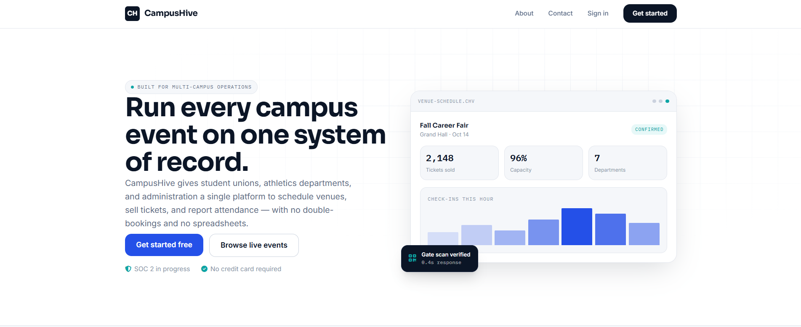
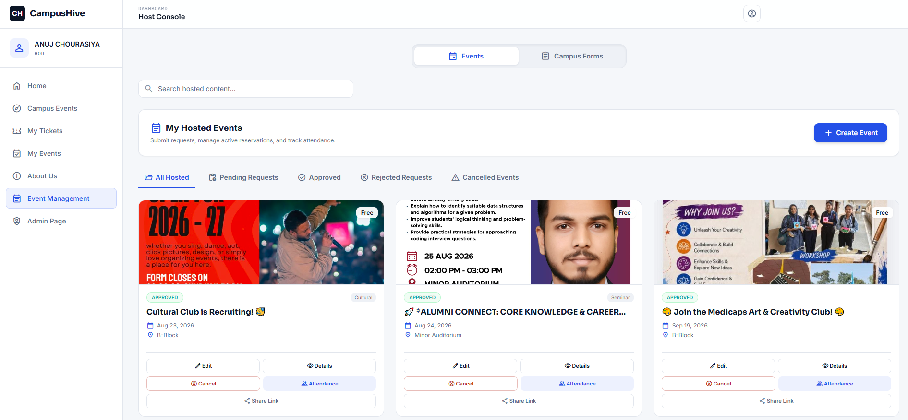
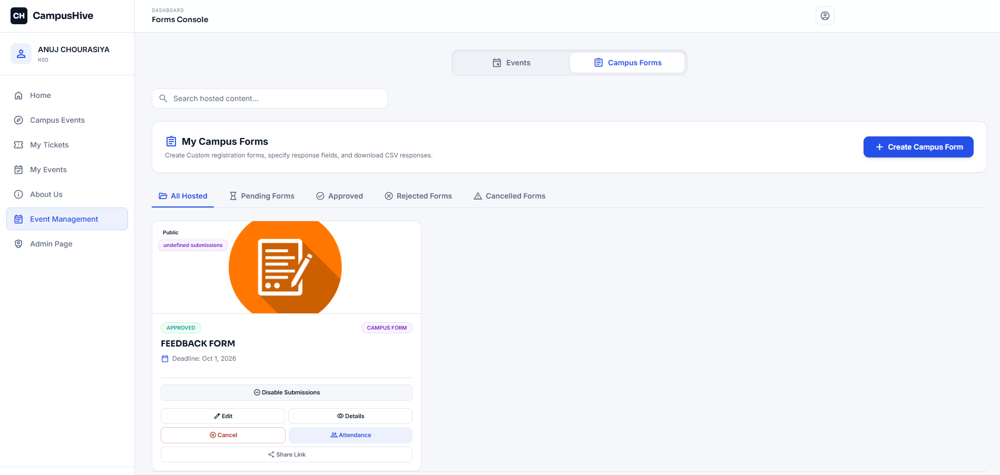
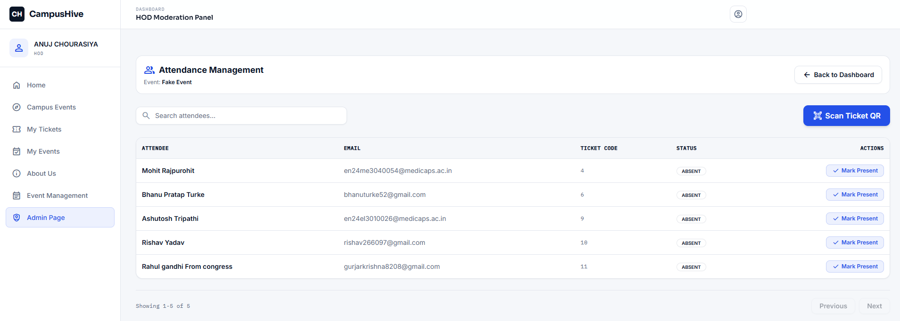
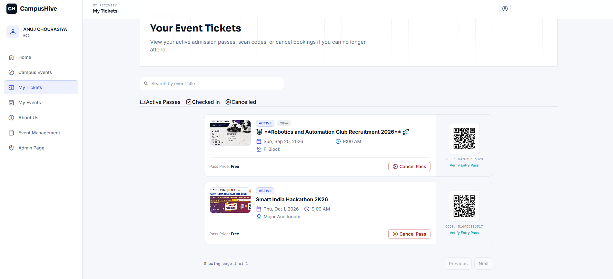
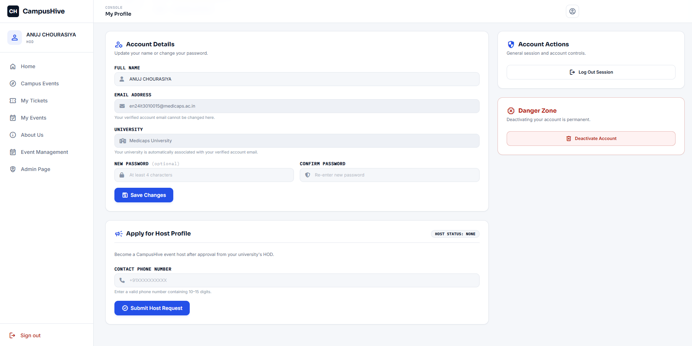

<p align="center">
  
</p>

<h1 align="center">🐝 CampusHive</h1>

<p align="center">
  <strong>Enterprise-Grade Campus Event Management, Dynamic Form Builder & AI-Powered Ticketing Platform</strong>
</p>

<p align="center">
  <a href="https://spring.io/projects/spring-boot"></a>
  <a href="https://www.oracle.com/java/"></a>
  <a href="https://cloud.google.com/vertex-ai"></a>
  <a href="https://www.mysql.com/"></a>
  <a href="https://resend.com/"></a>
  <a href="https://cloudinary.com/"></a>
  <a href="https://tailwindcss.com/"></a>
  <a href="https://www.docker.com/"></a>
</p>

---

## 📌 Table of Contents

- [Overview](#-overview)
- [Website Gallery](#-website-gallery)
- [Key Features](#-key-features)
  - [🤖 Spring AI & Google Gemini Multimodal Vision](#-spring-ai--google-gemini-multimodal-vision)
  - [📋 Dynamic Custom Form Builder (Typeform / Google Forms Engine)](#-dynamic-custom-form-builder-typeform--google-forms-engine)
  - [🎟️ Smart Ticketing & Concurrency-Safe Inventory](#️-smart-ticketing--concurrency-safe-inventory)
  - [⚡ Live QR Code Scanner & Attendance Roster](#-live-qr-code-scanner--attendance-roster)
  - [🏛️ Multi-Tenant Campus Isolation & Governance](#️-multi-tenant-campus-isolation--governance)
  - [🔐 Dual Auth (JWT + Google OAuth2) & Automatic Campus Domain Resolution](#-dual-auth-jwt--google-oauth2--automatic-campus-domain-resolution)
  - [📬 Asynchronous Email Job Queue & Transactional Delivery](#-asynchronous-email-job-queue--transactional-delivery)
- [User Roles & Permissions Matrix](#-user-roles--permissions-matrix)
- [Tech Stack Architecture](#-tech-stack-architecture)
- [Project Directory Layout](#-project-directory-layout)
- [Quick Start Setup Guide](#-quick-start-setup-guide)
  - [Prerequisites](#prerequisites)
  - [Option A: Docker Compose Deployment (Recommended)](#option-a-docker-compose-deployment-recommended)
  - [Option B: Local Development Setup (Manual)](#option-b-local-development-setup-manual)
- [Environment Configuration (`.env`)](#-environment-configuration-env)
- [REST API Reference & Documentation](#-rest-api-reference--documentation)
- [Default Super Admin Provisioning](#-default-super-admin-provisioning)
- [Contributing](#-contributing)
- [License](#-license)

---

## 📖 Overview

**CampusHive** (core module `EvenTAura`) is an enterprise-grade university event orchestration, ticketing, dynamic registration, and live attendance tracking platform built using **Java 21**, **Spring Boot 3.5**, and **Spring AI**.

Traditional campus event portals struggle with domain segregation, chaotic manual registrations, payment verification overhead, and attendance spoofing. CampusHive resolves this through:
- **Intelligent Multimodal AI**: Extracting schedule, dates, venues, and descriptions straight from promotional flyers using **Google Gemini 3.5 Flash**.
- **Dynamic Form Engine**: Creating flexible, multi-questionnaire forms with 10 question types, file upload attachments, and CSV exports.
- **Real-Time Attendance**: Hardware-agnostic camera check-ins using ZXing encrypted QR codes and live roster management.
- **Strict Multi-Tenancy**: Granular data and action isolation between participating universities, overseen by verified campus HODs and Super Administrators.

---

## 📸 Website Gallery

| **1. Landing & Event Discovery** | **2. Host Event Creation & AI Generator** |
| :---: | :---: |
|  |  |
| *Explore public and campus-exclusive events with high-contrast glassmorphic cards, search filters, and university selectors.* | *Create rich events, set ticketing quotas, configure fees with payment QRs, and auto-generate descriptions using Gemini AI.* |

| **3. Custom Form Builder & Submissions** | **4. Live Attendance & Audience Roster** |
| :---: | :---: |
|  |  |
| *Build drag-and-drop-style dynamic questionnaires with 10 field types, file uploads, submission limits, and CSV data exports.* | *Track registered attendees in real time. Manually toggle check-in statuses between `PRESENT` and `ABSENT`.* |

| **5. Real-Time QR Code Camera Scanner** | **6. HOD Moderation & Profile Integration** |
| :---: | :---: |
|  |  |
| *Instant venue gatekeeping with camera-based live QR ticket decoding and automated validation overlays.* | *HOD control room to approve/reject hosts, events, and forms, alongside Google OAuth2 & campus email linking.* |

> [!NOTE]
> Drop your showcase screenshots named `1.png` through `6.png` directly into `src/main/resources/static/images/` to populate the gallery above.

---

## ✨ Key Features

### 🤖 Spring AI & Google Gemini Multimodal Vision
- **Flyer-to-Event Generation**: Upload an event flyer or poster (`image/*`), and CampusHive invokes **Google Gemini 3.5 Flash** (`spring-ai-starter-model-google-genai`) via Spring AI's multimodal chat client.
- **Accurate Information Extraction**: Identifies event titles, start/end dates, schedules, venues, and key highlights without hallucinating missing data.
- **Optimized Copywriting**: Returns structured, markdown-ready, promotional descriptions with relevant emojis tailored for engagement.

### 📋 Dynamic Custom Form Builder (Typeform / Google Forms Engine)
- **Standalone Custom Forms**: Organize hackathons, recruitment drives, surveys, workshops, and team registrations.
- **10 Supported Field Types**:
  - `SHORT_ANSWER`, `PARAGRAPH`, `NUMBER`, `EMAIL`, `PHONE`, `DATE`
  - `MULTIPLE_CHOICE` (Single Select), `CHECKBOXES` (Multi-Select), `DROPDOWN`
  - `FILE_UPLOAD` (Direct cloud uploads via Cloudinary)
- **Field Constraints & Validation**: Regular expression patterns, character bounds (`minLength`/`maxLength`), numeric bounds (`minValue`/`maxValue`), and required toggles.
- **Submission Governance**: Registration start & deadline datetimes, max submission limits, multiple submission allowance, and live `acceptingResponses` toggle.
- **Paid Forms Support**: Attach registration fees, custom payment instructions, and host UPI/Payment QR codes.
- **Instant CSV Export**: Stream and download submissions on demand with one click formatted via **Apache Commons CSV**.

### 🎟️ Smart Ticketing & Concurrency-Safe Inventory
- **Optimistic Concurrency Control**: Backed by JPA `@Version` locking to eliminate race conditions and overselling during peak ticket drop rushes.
- **Free & Paid Event Workflows**: Paid events support UPI QR display and require attendee transaction screenshot proofs before ticket issuance.
- **Unique Numeric Codes & ZXing QR**: Generates tamper-proof 12-digit ticket codes rendered into scannable QR passes.
- **Self-Service Cancellation**: Attendees can cancel active tickets (if event cancellation is enabled), instantly restocking available inventory.

### ⚡ Live QR Code Scanner & Attendance Roster
- **In-Browser Camera Scanner**: Powered by HTML5-QRCode on the client side, interfacing with `/api/v1/tickets/{ticketCode}/checkin`.
- **Instant Verification**: Prevents duplicate entry by validating ticket state (`ACTIVE` vs `USED`), ticket expiration, and university matching.
- **Roster Controls**: Hosts and HODs can manually toggle attendee presence (`markPresent` / `markAbsent`) on a paginated live audience roster.

### 🏛️ Multi-Tenant Campus Isolation & Governance
- **University Scoping**: Events and forms can be marked as `PUBLIC` (cross-campus/global) or `UNIVERSITY_ONLY` (campus-exclusive).
- **HOD Administrative Ring**: HOD moderation powers (approving host applications, reviewing events, approving custom forms, and verifying attendance) are strictly bounded to their affiliated institution.
- **Super Admin Authority**: Onboard universities with official domains, logos, and portal status, appoint campus HODs, and govern users platform-wide.

### 🔐 Dual Auth (JWT + Google OAuth2) & Automatic Campus Domain Resolution
- **Stateless JWT Security**: Short-lived access tokens paired with secure, `HttpOnly`, `SameSite=Strict` refresh token cookies.
- **Google OAuth2 SSO**: One-click social sign-in. Automatically extracts domain from Google email (e.g., `user@mit.edu`) and links the profile directly to the registered University entity.
- **OTP Email Verification**: Registrations trigger a 6-digit verification OTP. Expired OTP records are cleaned by a scheduled background worker (`OtpCleanupScheduler`).

### 📬 Asynchronous Email Job Queue & Transactional Delivery
- **Transactional Job Queue**: Booking a ticket queues an asynchronous `EmailJob` in `PENDING` state.
- **Scheduled Background Worker**: `EmailJobExecutor` checks every 60 seconds, assembling a responsive HTML ticket voucher with event metadata and sending it via the **Resend API**.
- **Resilient Fault Tolerance**: Automatically retries transient delivery failures with retry counters and backoff delays before recording errors.

---

## 👥 User Roles & Permissions Matrix

| Capability / Module | Audience (`USER`) | Host (`HOST`) | Campus Head (`HOD`) | System Admin (`SUPER_ADMIN`) |
| :--- | :---: | :---: | :---: | :---: |
| Browse Public Events & Forms | ✅ | ✅ | ✅ | ✅ |
| Access Campus-Exclusive Events | Affiliated Campus | Affiliated Campus | Affiliated Campus | All |
| Register / Buy Tickets / Fill Forms | ✅ | ✅ | ✅ | ✅ |
| Apply for Host Privileges | ✅ | Current Host | — | — |
| Create Events & Custom Forms | ❌ | ✅ | ✅ | ✅ |
| Gemini AI Banner Description Tool | ❌ | ✅ | ✅ | ✅ |
| Scan QR Tickets & Manage Attendance | ❌ | Own Events | Own Campus Events | All Events |
| Export Form Responses to CSV | ❌ | Own Forms | Own Campus Forms | All Forms |
| Approve / Reject Host Applications | ❌ | ❌ | Campus Only | System Wide |
| Approve / Cancel Campus Events | ❌ | ❌ | Campus Only | System Wide |
| Moderate Custom Registration Forms | ❌ | ❌ | Campus Only | System Wide |
| Onboard Universities & Appoint HODs | ❌ | ❌ | ❌ | ✅ |
| Global User Governance & Role Upgrades | ❌ | ❌ | ❌ | ✅ |

---

## 🛠️ Tech Stack Architecture

### Backend Core
- **Language & Framework**: Java 21 LTS, Spring Boot 3.5.11
- **Security**: Spring Security 6, JWT (`jjwt-api 0.11.5`), Spring OAuth2 Client
- **Artificial Intelligence**: Spring AI 1.1.8 (`spring-ai-starter-model-google-genai`), Gemini 3.5 Flash
- **Persistence & ORM**: Spring Data JPA, Hibernate, Optimistic Locking (`@Version`)
- **Database Drivers**: MySQL Connector/J 8.4, PostgreSQL Driver
- **Fault Tolerance & Monitoring**: Resilience4j (`resilience4j-spring-boot3`), Spring Boot Actuator
- **API Documentation**: SpringDoc OpenAPI 3 (`springdoc-openapi-starter-webmvc-ui 2.8.9`)

### External Services & Utilities
- **Media CDN**: Cloudinary API 2.2.0 (Posters, logos, QR codes, file submissions)
- **Email Delivery**: Resend Java SDK 4.19.0, OkHttp3
- **Data Serialization**: Jackson, Apache Commons CSV 1.13.0
- **Barcode & QR**: Google ZXing Core & JavaSE 3.5.1

### Frontend Presentation
- **Templating**: Thymeleaf SSR with HTML5
- **Styling**: Tailwind CSS (Glassmorphism, custom micro-interactions, responsive design)
- **Client Scripting**: Vanilla JavaScript (ES6+ modular controllers, token auto-refresh interceptors)
- **Scanning Engine**: HTML5-QRCode
- **Typography & Icons**: Google Material Symbols & Modern Sans fonts

---

## 📂 Project Directory Layout

```text
Event-Management-System/
├── .mvn/                                # Maven wrapper configuration
├── src/
│   ├── main/
│   │   ├── java/org/anuj/EvenTAura/
│   │   │   ├── ai_feature/              # Google Gemini AI Vision integration
│   │   │   │   ├── controller/          # AI REST endpoints (/api/v1/ai)
│   │   │   │   ├── service/             # Multimodal prompt & media processing
│   │   │   │   └── dto/                 # AI request/response records
│   │   │   ├── config/                  # Cloudinary, Resend, and OpenAPI configurations
│   │   │   ├── controller/              # REST Controllers (Auth, Events, Tickets, Forms, Admin)
│   │   │   ├── dto/                     # Data Transfer Objects & Request validations
│   │   │   ├── exception/               # Global exception handlers & custom errors
│   │   │   ├── mapper/                  # Entity to DTO transformation mappers
│   │   │   ├── model/                   # JPA Entities (Event, CustomForm, Ticket, User, etc.)
│   │   │   │   └── enums/               # Status, Role, and Configuration enums
│   │   │   ├── payload/                 # Standardized API response wrappers
│   │   │   ├── repository/              # Spring Data JPA repositories
│   │   │   ├── security/                # Spring Security filter chain, JWT, OAuth2 handlers
│   │   │   ├── service/                 # Domain business logic interfaces & implementations
│   │   │   └── util/                    # Schedulers, QR generators, Startup jobs, Email executors
│   │   └── resources/
│   │       ├── application.yml          # Base Spring Boot configuration
│   │       ├── application-prod.yml     # Production & environment variable profile
│   │       ├── static/                  # Static assets: images, modular JS controllers
│   │       │   ├── images/              # Showcase gallery (1.png - 6.png), brand logos
│   │       │   └── js/                  # Auth, camera scanner, dynamic form builders
│   │       └── templates/               # Thymeleaf SSR UI views
│   └── test/                            # Unit and integration test suites
├── Dockerfile                           # Multi-stage Eclipse Temurin 21 production image
├── docker-compose.yml                   # Multi-container orchestration (Backend + MySQL 8.4)
├── env.example                          # Environment template file
├── pom.xml                              # Maven build specifications & dependencies
└── README.md                            # Comprehensive platform documentation
```

---

## 🚀 Quick Start Setup Guide

### Prerequisites
Before running CampusHive, ensure you have the following installed on your environment:
- [Git](https://git-scm.com/)
- [Java Development Kit (JDK) 21+](https://adoptium.net/temurin/releases/?version=21)
- [Docker Desktop](https://www.docker.com/products/docker-desktop/) *(Recommended for containerized deployment)*
- [Maven 3.9+](https://maven.apache.org/) *(Optional; wrapper included)*
- MySQL 8.x Server *(Only required if running outside Docker)*

---

### 🐳 Option A: Docker Compose Deployment (Recommended)

Docker Compose configures MySQL 8.4 and the Spring Boot application in isolated containers with health checks and volume persistence.

1. **Clone the Repository**:
   ```bash
   git clone https://github.com/Anuj-code-AI/Event-Management-System.git
   cd Event-Management-System
   ```

2. **Setup Environment Variables**:
   Copy the example environment file and configure your credentials:
   ```bash
   # Windows PowerShell
   Copy-Item env.example .env

   # Linux / macOS
   cp env.example .env
   ```
   *(Ensure `DB_URL=jdbc:mysql://mysql:3306/event_db`, `DB_USERNAME=root`, and `DB_PASSWORD=password` for Docker networking).*

3. **Launch the Container Cluster**:
   ```bash
   docker compose up --build
   ```
   *Docker compiles the source via multi-stage Maven build, waits for MySQL health check ping on container port `3306` (host mapped `3307`), runs migrations, seeds default admin credentials, and boots the backend on port `8080`.*

4. **Access the Application**:
   - Web App: [http://localhost:8080](http://localhost:8080)
   - Swagger UI: [http://localhost:8080/swagger-ui/index.html](http://localhost:8080/swagger-ui/index.html)

---

### ☕ Option B: Local Development Setup (Manual)

1. **Clone the Project**:
   ```bash
   git clone https://github.com/Anuj-code-AI/Event-Management-System.git
   cd Event-Management-System
   ```

2. **Configure Local MySQL Database**:
   Log into your local MySQL CLI or workbench and create the database:
   ```sql
   CREATE DATABASE event_db;
   ```

3. **Configure the `.env` File**:
   Update `.env` to point to your local MySQL instance:
   ```env
   SPRING_PROFILES_ACTIVE=prod
   DB_URL=jdbc:mysql://localhost:3306/event_db
   DB_USERNAME=your_mysql_username
   DB_PASSWORD=your_mysql_password
   PORT=8080
   ...
   ```

4. **Build and Package the Application**:
   - **Windows (PowerShell/CMD)**:
     ```powershell
     .\mvnw.cmd clean package -DskipTests
     ```
   - **Linux / macOS**:
     ```bash
     chmod +x mvnw
     ./mvnw clean package -DskipTests
     ```

5. **Start the Server**:
   - **Via Maven Plugin**:
     ```bash
     # Windows
     .\mvnw.cmd spring-boot:run

     # Linux / macOS
     ./mvnw spring-boot:run
     ```
   - **Via Compiled Executable Jar**:
     ```bash
     java -jar target/EvenTAura-0.0.1-SNAPSHOT.jar
     ```

6. **Open in Browser**:
   Navigate to [http://localhost:8080](http://localhost:8080).

---

## ⚙️ Environment Configuration (`.env`)

CampusHive utilizes environment-driven configuration for both development and production profiles:

| Key | Type | Default / Example | Purpose |
| :--- | :---: | :--- | :--- |
| `SPRING_PROFILES_ACTIVE` | String | `prod` | Activates production configuration profile (`application-prod.yml`). |
| `PORT` | Integer | `8080` | Web server listening port. |
| `BASE_URL` | String | `http://localhost:8080` | Base URL used for email hyperlinks and ticket QR decoding paths. |
| `DB_URL` | String | `jdbc:mysql://localhost:3306/event_db` | JDBC connection string (use `jdbc:mysql://mysql:3306/event_db` in Docker). |
| `DB_USERNAME` | String | `root` | Database username. |
| `DB_PASSWORD` | String | `password` | Database password. |
| `DDL_AUTO` | String | `update` | Hibernate DDL generation mode (`update`, `validate`, `none`). |
| `APP_SECRET_KEY` | String | *(Hex Secret)* | 256-bit secret key used to sign and verify HMAC-SHA256 JWT tokens. |
| `ACCESS_EXPIRY` | Long | `900000` | Access Token lifetime in milliseconds (e.g., `900000` = 15 minutes). |
| `REFRESH_EXPIRY` | Long | `604800000` | Refresh Token lifetime in milliseconds (e.g., `604800000` = 7 days). |
| `COOKIE_SECURE` | Boolean | `false` | Set to `true` in production to enforce `HTTPS`-only transmission for cookies. |
| `COOKIE_SITE` | String | `Lax` / `Strict` | Cookie SameSite policy (`Strict` recommended for CSRF prevention). |
| `GOOGLE_CLIENT_ID` | String | *(Google Client ID)* | Google OAuth2 Client ID from Google Cloud Console. |
| `GOOGLE_CLIENT_SECRET` | String | *(Google Client Secret)* | Google OAuth2 Client Secret for social sign-in. |
| `IMAGE_CLOUD_NAME` | String | *(Cloudinary Name)* | Cloudinary cloud account namespace. |
| `IMAGE_CLOUD_API_KEY` | String | *(Cloudinary Key)* | Cloudinary REST API access key. |
| `IMAGE_CLOUD_SECRET` | String | *(Cloudinary Secret)* | Cloudinary REST API secret token. |
| `RESEND_API_KEY` | String | `re_123...` | API key for Resend email delivery service. |
| `EMAIL_FROM` | String | `onboarding@resend.dev` | Verified sender email address for ticket and OTP dispatch. |
| `GEMINI_API_KEY` | String | `AIzaSy...` | Google AI Studio API key for multimodal flyer description generation. |
| `ADMIN_NAME` | String | `Super Admin` | Display name for system bootstrap administrator. |
| `ADMIN_EMAIL` | String | `admin@campushive.com` | Login email for system bootstrap administrator. |
| `ADMIN_PASSWORD` | String | `Admin@12345` | Login password for system bootstrap administrator. |
| `API_DOC` | Boolean | `true` | Enables or disables OpenAPI specification `/v3/api-docs`. |
| `SWAGGER_UI` | Boolean | `true` | Enables or disables interactive Swagger UI `/swagger-ui/index.html`. |

---

## 📡 REST API Reference & Documentation

Interactive API documentation and schema explorers are available when `SWAGGER_UI=true`:
- **Swagger UI Console**: [http://localhost:8080/swagger-ui/index.html](http://localhost:8080/swagger-ui/index.html)
- **OpenAPI JSON Spec**: [http://localhost:8080/v3/api-docs](http://localhost:8080/v3/api-docs)

### Primary API Endpoints Overview

#### 🔐 Authentication & Accounts (`/api/v1/auth`)
| Method | Endpoint | Description | Access |
| :--- | :--- | :--- | :--- |
| `POST` | `/api/v1/auth/register` | Register new account & trigger email OTP | Public |
| `POST` | `/api/v1/auth/verify-email` | Verify 6-digit OTP code & return tokens | Public |
| `POST` | `/api/v1/auth/resend-otp` | Resend verification OTP code | Public |
| `POST` | `/api/v1/auth/login` | Authenticate with email & password | Public |
| `POST` | `/api/v1/auth/refresh` | Exchange HttpOnly refresh cookie for access token | Public |
| `POST` | `/api/v1/auth/logout` | Revoke active refresh token and clear cookie | Authenticated |

#### 🤖 AI Multimodal Vision (`/api/v1/ai`)
| Method | Endpoint | Description | Access |
| :--- | :--- | :--- | :--- |
| `POST` | `/api/v1/ai/generate-description` | Analyze event flyer image with Gemini AI & return description | Host / HOD / Admin |

#### 📅 Event Management (`/api/v1/events`)
| Method | Endpoint | Description | Access |
| :--- | :--- | :--- | :--- |
| `GET` | `/api/v1/events/public-events` | Paginated search of public events | Public |
| `GET` | `/api/v1/events/university-events` | Paginated events restricted to user's university | Authenticated |
| `GET` | `/api/v1/events/{eventId}` | Fetch full details of an event | Public |
| `POST` | `/api/v1/events` | Create new event with banner & payment QR | Host / HOD |
| `PATCH` | `/api/v1/events/{eventId}` | Update existing event details | Host / HOD |
| `DELETE`| `/api/v1/events/{eventId}/cancel` | Cancel event and notify attendees | Host / HOD |
| `POST` | `/api/v1/events/{eventId}/restore` | Reactivate a cancelled event | Host / HOD |

#### 📋 Custom Forms & Surveys (`/api/v1/custom-forms`)
| Method | Endpoint | Description | Access |
| :--- | :--- | :--- | :--- |
| `GET` | `/api/v1/custom-forms/public-forms` | List approved public registration forms | Public |
| `GET` | `/api/v1/custom-forms/university-forms`| List campus-exclusive forms | Authenticated |
| `POST` | `/api/v1/custom-forms` | Create dynamic multi-field form | Host / HOD |
| `PUT` | `/api/v1/custom-forms/{formId}` | Modify form structure, questions, and dates | Form Owner / HOD |
| `POST` | `/api/v1/custom-forms/{formId}/submit` | Submit responses with multipart files | Authenticated |
| `GET` | `/api/v1/custom-forms/{formId}/responses` | Paginated responses with search & sorting | Form Owner / HOD |
| `GET` | `/api/v1/custom-forms/{formId}/responses/export` | **Export all submissions as CSV spreadsheet** | Form Owner / HOD |
| `PATCH`| `/api/v1/custom-forms/{formId}/accepting-responses` | Toggle form submission window | Form Owner / HOD |

#### 🎟️ Tickets & Attendance Tracking (`/api/v1/tickets`)
| Method | Endpoint | Description | Access |
| :--- | :--- | :--- | :--- |
| `POST` | `/api/v1/tickets/{eventId}/buy` | Purchase ticket / register with payment proof | Authenticated |
| `GET` | `/api/v1/tickets/my-tickets` | List user's booked tickets | Authenticated |
| `GET` | `/api/v1/tickets/{ticketId}/qr` | Generate dynamic ZXing ticket QR image | Public / Authenticated |
| `POST` | `/api/v1/tickets/{ticketCode}/checkin` | Check in attendee via camera QR scanner | Host / HOD |
| `GET` | `/api/v1/tickets/{ticketCode}/verify` | Verify ticket validity without consuming pass | Host / HOD |
| `POST` | `/api/v1/tickets/{ticketId}/cancel` | Cancel ticket and restock event inventory | Ticket Owner |
| `GET` | `/api/v1/tickets/{eventId}/audienceList` | Paginated live roster of attendees | Host / HOD |
| `POST` | `/api/v1/tickets/{ticketId}/markPresent`| Manually mark attendee `PRESENT` | Host / HOD |
| `POST` | `/api/v1/tickets/{ticketId}/markAbsent` | Revert attendance to `ABSENT` | Host / HOD |

#### 🏛️ Campus HOD Moderation (`/api/v1/admin`)
| Method | Endpoint | Description | Access |
| :--- | :--- | :--- | :--- |
| `GET` | `/api/v1/admin/host/pending` | Review pending host privilege requests | HOD |
| `PATCH`| `/api/v1/admin/host/{id}/approve` | Approve host application for campus | HOD |
| `PATCH`| `/api/v1/admin/host/{id}/reject` | Reject host application | HOD |
| `GET` | `/api/v1/admin/events/pending` | Review campus events awaiting approval | HOD |
| `PATCH`| `/api/v1/admin/events/{id}/approve` | Approve event publication | HOD |
| `PATCH`| `/api/v1/admin/events/{id}/reject` | Reject event request | HOD |
| `POST` | `/api/v1/admin/custom-forms/{id}/approve` | Approve custom form publication | HOD |
| `POST` | `/api/v1/admin/custom-forms/{id}/reject` | Reject custom form publication | HOD |

#### 👑 Super Administrator Management (`/api/v1/admin`)
| Method | Endpoint | Description | Access |
| :--- | :--- | :--- | :--- |
| `POST` | `/api/v1/admin/university` | Onboard university with name, domain, & logo | Super Admin |
| `PATCH`| `/api/v1/admin/university/{id}` | Update university settings | Super Admin |
| `DELETE`| `/api/v1/admin/university/{id}` | Deactivate / remove university | Super Admin |
| `PATCH`| `/api/v1/admin/hod/{userId}` | Promote registered user to campus `HOD` | Super Admin |
| `GET` | `/api/v1/admin/users` | Paginated overview of all platform users | Super Admin |

---

## 👑 Default Super Admin Provisioning

When CampusHive boots up, `EventStartUpJob` verifies that a Super Administrator account exists. If not, it automatically provisions the user using the credentials configured in `.env`:

```env
ADMIN_NAME=Super Admin
ADMIN_EMAIL=admin@campushive.com
ADMIN_PASSWORD=YourSecurePassword123
```

> [!TIP]
> If you ever update `ADMIN_PASSWORD` in your production environment variables (e.g., on Render or Railway), `EventStartUpJob` automatically detects the change, re-hashes the new password with BCrypt, and updates the administrator record on startup.

---

## 🤝 Contributing

Contributions are welcomed! Follow these steps to submit your contributions:

1. **Fork the Repository** on GitHub.
2. **Create a Feature Branch**:
   ```bash
   git checkout -b feature/dynamic-analytics
   ```
3. **Commit Your Changes** with descriptive messages:
   ```bash
   git commit -m "feat: add real-time analytics aggregation for HOD dashboard"
   ```
4. **Push to Your Branch**:
   ```bash
   git push origin feature/dynamic-analytics
   ```
5. **Open a Pull Request** describing your changes and testing strategy.

---

## 📄 License

This project is licensed under the **Apache License 2.0**. You are free to use, modify, and distribute this software in compliance with the license terms.

---

<p align="center">
  Crafted with ❤️ by <a href="https://github.com/Anuj-code-AI"><strong>Anuj</strong></a> & the <strong>CampusHive Community</strong>.
</p>
